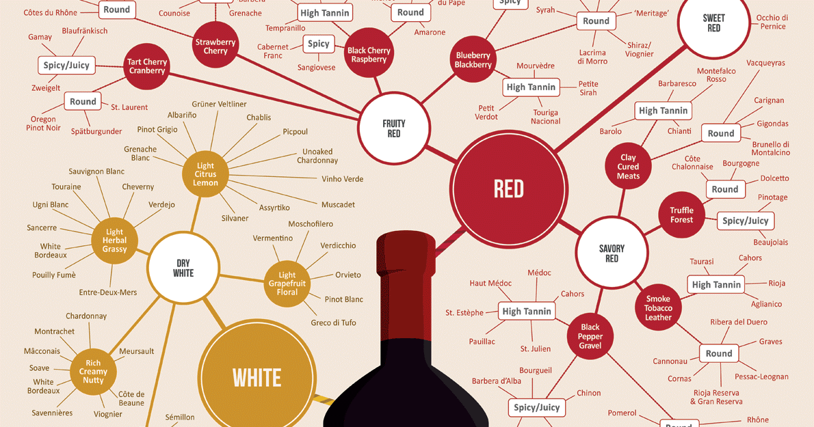

# hybrid fuzzy rough rule induction and feature selection
### Introduction
This reposoirty is implementation of the paper `Hybrid Fuzzy-Rough Rule Induction and Feature Selection 2009`. This paper proposes an approach, based on fuzzy-rough sets. The algorithm is experimentally evaluated against leading classifiers, including fuzzy and rough rule inducers, and shown to be effective. In this project wine
dataset is used which contains the results of a chemical analysis of wines grown in a specific area of Italy. Three types of wine are represented in the 178 samples, with the results of 13 chemical analyses recorded for each sample.

### Table of Contents

1. [Installation](#installation)
2. [Motivation](#motivation)
3. [File Descriptions](#files)
4. [Results](#results)
5. [Licensing, Authors, and Acknowledgements](#licensing)

  
 

## Installation 

This project uses 'java 8':
* java

